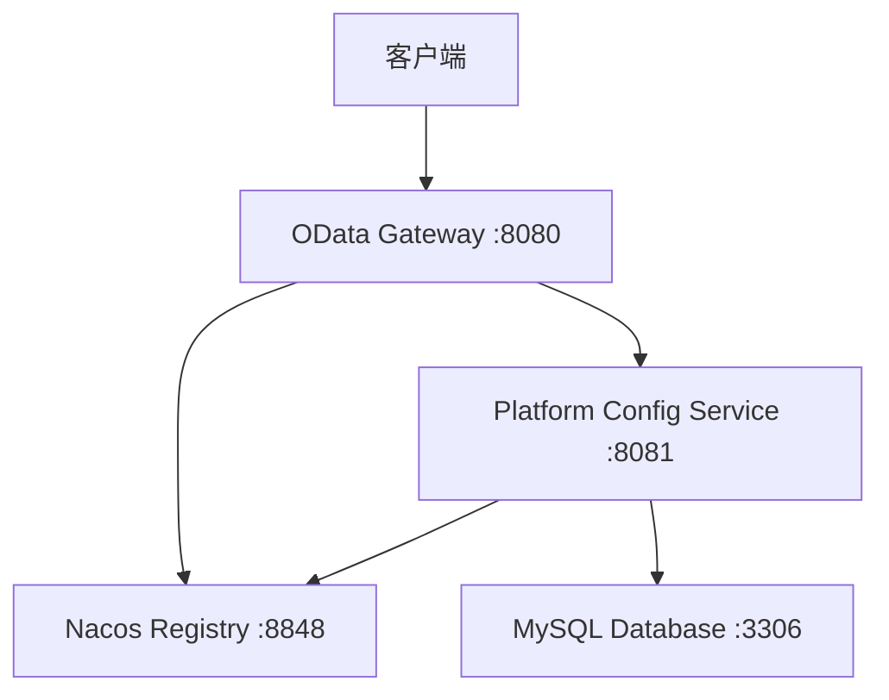

# OData Cloud Platform

基于Spring Cloud和Nacos的OData协议云平台，采用微服务架构，支持动态实体管理和标准OData查询。

## 🎯 项目状态

✅ **微服务架构重构完成** - 成功实现完整的微服务架构  
✅ **动态实体管理** - 支持运行时实体注册和表创建  
✅ **OData协议支持** - 完整的OData v4协议实现  
✅ **服务间通信** - 基于OpenFeign的微服务通信  
✅ **测试验证** - 所有核心功能已测试通过  

> **最新更新**: 微服务架构重构已完成，所有服务正常运行，核心功能测试通过。详细测试报告请查看 [test-microservices.md](test-microservices.md)

## 🏗️ 架构概述

```
┌─────────────────┐    ┌─────────────────┐    ┌─────────────────┐
│   客户端应用     │    │   OData网关     │    │  平台配置服务    │
│   (Frontend)    │───▶│   :8080        │───▶│   :8081        │
└─────────────────┘    └─────────────────┘    └─────────────────┘
                              │                        │
                              ▼                        ▼
                       ┌─────────────────┐    ┌─────────────────┐
                       │   Nacos注册中心  │    │   MySQL数据库   │
                       │   :8848        │    │   :3306        │
                       └─────────────────┘    └─────────────────┘
```

## 📦 服务模块

### 1. **公共模块 (odata-common)**
- **职责**: 提供公共实体、DTO、客户端接口
- **技术栈**: Spring Boot, OpenFeign, FastJSON

### 2. **OData网关服务 (odata-gateway:8080)**
- **职责**: OData协议解析和路由，API网关
- **技术栈**: Spring Cloud Gateway, Apache Olingo, Nacos
- **功能**:
  - ✅ 标准OData协议支持
  - ✅ 基于应用的服务隔离
  - ✅ 复杂查询支持 ($filter, $orderby, $top, $skip, $select, $count)
  - ✅ CRUD操作支持
  - ✅ 服务发现和负载均衡

### 3. **平台配置服务 (platform-config-service:8081)**
- **职责**: 应用和动态实体管理，数据库操作
- **技术栈**: Spring Boot, MyBatis Plus, Nacos, MySQL
- **功能**:
  - ✅ 应用生命周期管理 (CRUD)
  - ✅ 应用实体关联管理
  - ✅ 动态实体注册与管理
  - ✅ 数据库表自动创建
  - ✅ 查询执行服务

## 🚀 快速开始

### 前置条件

- Java 8+
- Maven 3.6+
- MySQL 8.0+
- Nacos Server

### 一键启动

#### Windows
```cmd
start-cloud.cmd
```

#### 手动启动

1. **启动Nacos**
```bash
cd nacos/nacos-server/bin
./startup.cmd -m standalone
```

2. **配置数据库**
创建数据库：
```sql
CREATE DATABASE odata_platform CHARACTER SET utf8mb4 COLLATE utf8mb4_unicode_ci;
```

3. **启动服务**
```bash
# 构建项目
mvn clean package -DskipTests

# 启动平台配置服务
cd platform-config-service
mvn spring-boot:run

# 启动OData网关服务 (新终端)
cd odata-gateway
mvn spring-boot:run
```

## 📋 服务信息

| 服务 | 端口 | 描述 | 健康检查 |
|------|------|------|----------|
| Nacos | 8848 | 服务注册中心 | http://localhost:8848/nacos |
| Platform Config Service | 8081 | 平台配置服务 | http://localhost:8081/actuator/health |
| OData Gateway Service | 8080 | OData网关服务 | http://localhost:8080/actuator/health |
| MySQL | 3306 | 数据库 | - |

## 🧪 API测试

### 1. 平台配置API

```bash
# 获取所有应用
curl http://localhost:8081/platform/applications

# 根据代码获取应用
curl http://localhost:8081/platform/applications/code/DEMO

# 获取应用实体
curl http://localhost:8081/platform/applications/1/entities
```

### 2. 动态实体管理

```bash
# 注册动态实体
curl -X POST http://localhost:8081/platform/applications/1/dynamic-entities \
  -H "Content-Type: application/json" \
  -d '{
    "entityName": "Customer",
    "tableName": "demo_customers", 
    "description": "Customer management",
    "autoCreate": true,
    "fields": [
      {
        "fieldName": "id",
        "dataType": "LONG",
        "key": true,
        "nullable": false
      },
      {
        "fieldName": "name",
        "dataType": "STRING", 
        "length": 100,
        "nullable": false
      },
      {
        "fieldName": "email",
        "dataType": "STRING",
        "length": 255,
        "nullable": true
      }
    ]
  }'

# 获取动态实体
curl http://localhost:8081/platform/applications/1/dynamic-entities/Customer

# 删除动态实体
curl -X DELETE "http://localhost:8081/platform/applications/1/dynamic-entities/Customer?dropTable=true"
```

### 3. OData查询API

```bash
# 获取服务文档
curl http://localhost:8080/odata/DEMO

# 查询所有产品
curl http://localhost:8080/odata/DEMO/Products

# 复杂查询
curl "http://localhost:8080/odata/DEMO/Products?\$filter=price gt 100&\$orderby=name&\$top=5"

# 获取单个产品
curl http://localhost:8080/odata/DEMO/Products(1)

# 创建产品
curl -X POST http://localhost:8080/odata/DEMO/Products \
  -H "Content-Type: application/json" \
  -d '{
    "name": "New Product",
    "description": "A new product",
    "price": 199.99,
    "stock": 10
  }'
```

## 🔧 开发指南

### 项目结构

```
odata-cloud/
├── odata-common/              # 公共模块
│   ├── src/main/java/com/jinyi/common/
│   │   ├── entity/           # 公共实体
│   │   ├── dto/              # 数据传输对象
│   │   └── client/           # Feign客户端
│   └── pom.xml
├── odata-gateway/            # OData网关服务
│   ├── src/main/java/com/jinyi/gateway/
│   │   ├── odata/           # OData协议处理
│   │   └── GatewayApplication.java
│   └── pom.xml
├── platform-config-service/  # 平台配置服务
│   ├── src/main/java/com/jinyi/platform/
│   │   ├── entity/          # 数据库实体
│   │   ├── mapper/          # MyBatis映射器
│   │   ├── service/         # 业务逻辑层
│   │   └── controller/      # 控制器层
│   └── pom.xml
└── pom.xml                   # 父项目配置
```

### 添加新功能

1. **扩展平台配置**
   - 在 `platform-config-service` 中添加新的业务逻辑
   - 更新 `odata-common` 中的DTO定义
   - 添加相应的API端点

2. **扩展OData功能**
   - 在 `odata-gateway` 中扩展协议处理
   - 添加新的OData操作支持
   - 更新客户端接口

3. **添加新微服务**
   - 创建新的Maven模块
   - 继承父项目配置
   - 配置Nacos注册发现
   - 实现业务逻辑

## 🌐 服务交互

### 服务依赖关系


### 通信方式
- **服务注册与发现**: Nacos
- **服务间通信**: OpenFeign (HTTP/REST)
- **配置管理**: Nacos Config
- **数据存储**: MySQL
- **API网关**: Spring Cloud Gateway

## 📊 架构优势

### 🎯 **服务解耦**
- **职责分离**: OData协议处理与平台配置完全分离
- **独立部署**: 各服务可独立开发、测试、部署
- **技术栈灵活**: 各服务可选择最适合的技术栈

### 🔄 **可扩展性**
- **水平扩展**: 各服务可独立扩展实例数量
- **负载均衡**: 通过Nacos实现自动负载均衡
- **服务治理**: 支持服务熔断、限流等治理功能

### 🛡️ **高可用性**
- **故障隔离**: 单个服务故障不影响其他服务
- **服务发现**: 自动检测服务健康状态
- **配置热更新**: 支持配置动态更新

### 📈 **可维护性**
- **代码组织**: 按业务领域清晰分层
- **团队协作**: 不同团队可负责不同服务
- **版本管理**: 各服务独立版本控制

## 🛠️ 故障排除

### 常见问题

1. **服务无法启动**
   - 检查端口是否被占用
   - 确认Nacos服务正在运行
   - 查看服务日志排查错误

2. **服务注册失败**
   - 确认Nacos服务正常运行
   - 检查网络连接
   - 验证配置文件中的Nacos地址

3. **数据库连接失败**
   - 确认MySQL服务正常运行
   - 检查数据库连接配置
   - 验证数据库用户权限

### 调试模式

启用详细日志：
```yaml
logging:
  level:
    com.jinyi: DEBUG
    org.springframework.cloud: DEBUG
    feign: DEBUG
```

## 📚 相关文档

- [基于应用的动态实体管理](APPLICATION_BASED_DYNAMIC_ENTITIES.md)
- [基于应用的OData架构](APPLICATION_BASED_ODATA.md)
- [OData查询示例](ODATA_QUERY_EXAMPLES.md)
- [动态实体注册](DYNAMIC_ENTITY_REGISTRATION.md)
- [项目结构说明](PROJECT_STRUCTURE.md)

## 🔮 未来扩展

### 计划功能
- [ ] 服务网格集成 (Istio)
- [ ] 分布式链路追踪 (Zipkin/Jaeger)
- [ ] 统一日志收集 (ELK Stack)
- [ ] 监控告警 (Prometheus + Grafana)
- [ ] 分布式事务支持 (Seata)
- [ ] 缓存策略 (Redis)

### 性能优化
- [ ] 数据库读写分离
- [ ] 异步消息处理 (RocketMQ)
- [ ] 连接池优化
- [ ] 查询缓存

## 📄 许可证

本项目采用 MIT 许可证。